# Documentação do Sistema de Gestão de Condomínios

## 1. Visão Geral do Projeto

Este é um sistema completo de gestão de condomínios desenvolvido como trabalho acadêmico. O projeto implementa uma plataforma web responsiva que permite a administração de condomínios, moradores, ocorrências, reservas, comunicados e um marketplace integrado.

### 1.1 Objetivos
- Facilitar a gestão administrativa de condomínios
- Permitir comunicação eficiente entre administradores, síndicos e moradores
- Oferecer ferramentas de controle financeiro e reservas
- Disponibilizar marketplace para produtos e serviços

### 1.2 Público-alvo
- **Administradores**: Gestão completa do sistema e múltiplos condomínios
- **Síndicos**: Gestão do condomínio específico
- **Moradores**: Acesso a serviços e informações do condomínio

---

## 2. Tecnologias Utilizadas

### 2.1 Frontend
- **React 18.3.1**: Biblioteca principal para construção da interface
- **TypeScript**: Linguagem de programação com tipagem estática
- **Vite**: Build tool e desenvolvimento rápido
- **React Router DOM 6.30.1**: Gerenciamento de rotas
- **Tailwind CSS**: Framework CSS utilitário
- **shadcn/ui**: Biblioteca de componentes UI reutilizáveis
- **Radix UI**: Componentes acessíveis e não estilizados
- **React Hook Form**: Gerenciamento de formulários
- **Zod**: Validação de schemas
- **TanStack Query**: Gerenciamento de estado e cache de dados
- **Lucide React**: Ícones
- **date-fns**: Manipulação de datas
- **Recharts**: Gráficos e visualizações

### 2.2 Backend
- **Supabase**: Plataforma backend-as-a-service
  - PostgreSQL: Banco de dados relacional
  - Row Level Security (RLS): Segurança em nível de linha
  - Realtime: Atualizações em tempo real
  - Edge Functions: Funções serverless (Deno)
  - Authentication: Sistema de autenticação completo

### 2.3 APIs Externas
- **ViaCEP API**: Consulta de endereços por CEP (Brasil)
- **OpenWeatherMap API**: Dados meteorológicos
- **DummyJSON API**: Produtos e categorias para marketplace

---

## 3. Arquitetura do Projeto

### 3.1 Visão Geral da Arquitetura

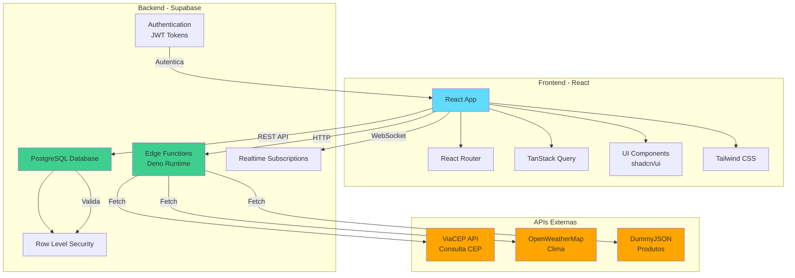

### 3.2 Fluxo de Autenticação

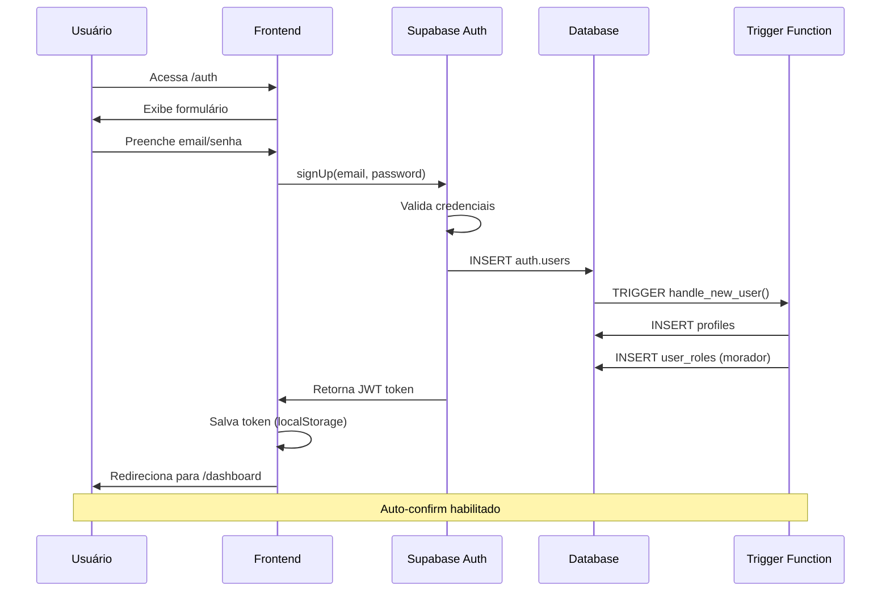

### 3.3 Sistema de Roles e Permissões

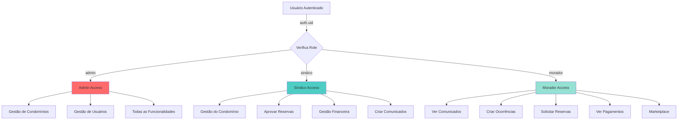

### 3.4 Estrutura de Diretórios

```
├── public/                    # Arquivos estáticos
│   ├── robots.txt            # SEO - instruções para crawlers
│   └── favicon.ico           # Ícone do site
│
├── src/                       # Código fonte principal
│   ├── components/           # Componentes reutilizáveis
│   │   ├── auth/            # Componentes de autenticação
│   │   ├── layout/          # Componentes de layout
│   │   └── ui/              # Componentes UI (shadcn)
│   │
│   ├── hooks/               # React Hooks customizados
│   │   ├── use-mobile.tsx   # Hook para detecção mobile
│   │   └── use-toast.ts     # Hook para notificações
│   │
│   ├── integrations/        # Integrações externas
│   │   └── supabase/        # Cliente e tipos Supabase
│   │       ├── client.ts    # Cliente configurado
│   │       └── types.ts     # Tipos TypeScript gerados
│   │
│   ├── lib/                 # Utilitários e helpers
│   │   └── utils.ts         # Funções auxiliares
│   │
│   ├── pages/               # Páginas da aplicação
│   │   ├── Auth.tsx         # Página de login/registro
│   │   ├── Dashboard.tsx    # Dashboard principal
│   │   ├── Announcements.tsx # Comunicados
│   │   ├── Financial.tsx    # Gestão financeira
│   │   ├── Marketplace.tsx  # Marketplace
│   │   ├── MyOrders.tsx     # Pedidos do usuário
│   │   ├── Occurrences.tsx  # Ocorrências
│   │   ├── Reservations.tsx # Reservas de áreas
│   │   ├── Residents.tsx    # Moradores
│   │   ├── ResidentsManagement.tsx # Gestão de moradores
│   │   ├── Users.tsx        # Gestão de usuários
│   │   ├── Condominiums.tsx # Gestão de condomínios
│   │   ├── Chat.tsx         # Sistema de chat
│   │   └── NotFound.tsx     # Página 404
│   │
│   ├── App.tsx              # Componente raiz
│   ├── main.tsx             # Entry point
│   └── index.css            # Estilos globais e design system
│
├── supabase/                 # Configuração backend
│   ├── functions/           # Edge Functions
│   │   ├── get-cep/        # Função consulta CEP
│   │   ├── get-weather/    # Função clima
│   │   ├── fetch-products/ # Função produtos
│   │   └── fetch-categories/ # Função categorias
│   │
│   ├── migrations/          # Migrações do banco de dados
│   └── config.toml          # Configuração Supabase
│
└── [arquivos de configuração]
    ├── vite.config.ts       # Configuração Vite
    ├── tailwind.config.ts   # Configuração Tailwind
    ├── tsconfig.json        # Configuração TypeScript
    └── package.json         # Dependências do projeto
```

---

## 4. Frontend - Estrutura e Funcionalidades

### 4.1 Sistema de Autenticação
- **Localização**: `src/pages/Auth.tsx`, `src/components/auth/AuthForm.tsx`
- **Funcionalidades**:
  - Login com email e senha
  - Registro de novos usuários
  - Persistência de sessão via localStorage
  - Redirecionamento automático baseado em autenticação
  - Validação de email autorizado

### 4.2 Sistema de Roles (Papéis)
- **Tipos de usuários**:
  - `admin`: Acesso total ao sistema
  - `sindico`: Gestão do condomínio
  - `morador`: Acesso limitado a funcionalidades básicas
- **Implementação**: `src/components/layout/RoleSwitcher.tsx`
- **Controle de acesso**: Role-based no DashboardLayout

### 4.3 Layout e Navegação
- **DashboardLayout**: `src/components/layout/DashboardLayout.tsx`
  - Sidebar responsiva com navegação
  - Header com indicador de role
  - Gestão de estado de autenticação
  - Seletor de papel do usuário
- **AppSidebar**: `src/components/layout/AppSidebar.tsx`
  - Navegação contextual por role
  - Ícones e labels descritivos
  - Integração com React Router

### 4.4 Páginas e Funcionalidades

#### 4.4.1 Dashboard
- **Arquivo**: `src/pages/Dashboard.tsx`
- **Funcionalidades**:
  - Exibição de estatísticas personalizadas por role
  - Card de clima atual com geolocalização
  - Consulta de CEP integrada
  - Informações do condomínio do usuário
  - Contadores: comunicados, pagamentos, reservas, ocorrências

#### 4.4.2 Comunicados (Announcements)
- **Arquivo**: `src/pages/Announcements.tsx`
- **Funcionalidades**:
  - Listagem de comunicados
  - Criação de novos comunicados (admin/sindico)
  - Filtros e busca
  - Sistema de comentários

#### 4.4.3 Gestão Financeira
- **Arquivo**: `src/pages/Financial.tsx`
- **Funcionalidades**:
  - Controle de receitas e despesas
  - Registro de pagamentos
  - Relatórios financeiros
  - Visualização por período

#### 4.4.4 Marketplace
- **Arquivo**: `src/pages/Marketplace.tsx`
- **Funcionalidades**:
  - Grade de produtos (1 coluna mobile, 3 colunas desktop)
  - Sistema de busca
  - Filtros por categoria
  - Carrinho de compras
  - Botão de adicionar ao carrinho
  - Integração com API externa

#### 4.4.5 Meus Pedidos
- **Arquivo**: `src/pages/MyOrders.tsx`
- **Funcionalidades**:
  - Histórico de pedidos do usuário
  - Status de entrega
  - Detalhes dos produtos

#### 4.4.6 Ocorrências
- **Arquivo**: `src/pages/Occurrences.tsx`
- **Funcionalidades**:
  - Registro de problemas/reclamações
  - Acompanhamento de status
  - Sistema de prioridades
  - Gestão por síndico/admin

#### 4.4.7 Reservas
- **Arquivo**: `src/pages/Reservations.tsx`
- **Funcionalidades**:
  - Reserva de áreas comuns
  - Calendário de disponibilidade
  - Gestão de horários
  - Aprovação de reservas

#### 4.4.8 Moradores
- **Arquivo**: `src/pages/Residents.tsx`, `src/pages/ResidentsManagement.tsx`
- **Funcionalidades**:
  - Listagem de moradores
  - Cadastro e edição
  - Vinculação com unidades
  - Gestão de permissões

#### 4.4.9 Usuários
- **Arquivo**: `src/pages/Users.tsx`
- **Funcionalidades**:
  - Gestão de usuários do sistema (admin)
  - Atribuição de roles
  - Ativação/desativação de contas

#### 4.4.10 Condomínios
- **Arquivo**: `src/pages/Condominiums.tsx`
- **Funcionalidades**:
  - Cadastro de condomínios (admin)
  - Edição de informações
  - Gestão de unidades

#### 4.4.11 Chat
- **Arquivo**: `src/pages/Chat.tsx`
- **Funcionalidades**:
  - Mensagens em tempo real
  - Chat entre moradores/síndico
  - Histórico de conversas

### 4.5 Componentes UI Reutilizáveis
Todos localizados em `src/components/ui/`:
- **Formulários**: Input, Textarea, Select, Checkbox, Radio, Switch
- **Navegação**: Button, Dropdown, Menu, Tabs, Breadcrumb
- **Feedback**: Toast, Alert, Dialog, Popover, Tooltip
- **Layout**: Card, Separator, Sidebar, Sheet
- **Dados**: Table, Calendar, Chart, Progress
- **E mais**: Avatar, Badge, Skeleton, Accordion, Carousel, etc.

### 4.6 Design System
- **Arquivo principal**: `src/index.css`
- **Configuração**: `tailwind.config.ts`
- **Características**:
  - Sistema de cores HSL com variáveis CSS
  - Modo claro/escuro (light/dark mode)
  - Tokens semânticos (primary, secondary, accent, etc.)
  - Tipografia responsiva
  - Animações suaves
  - Acessibilidade (WCAG)

---

## 5. Backend - Estrutura e Funcionalidades

### 5.1 Banco de Dados PostgreSQL

#### 5.1.0 Diagrama Entidade-Relacionamento (ERD)

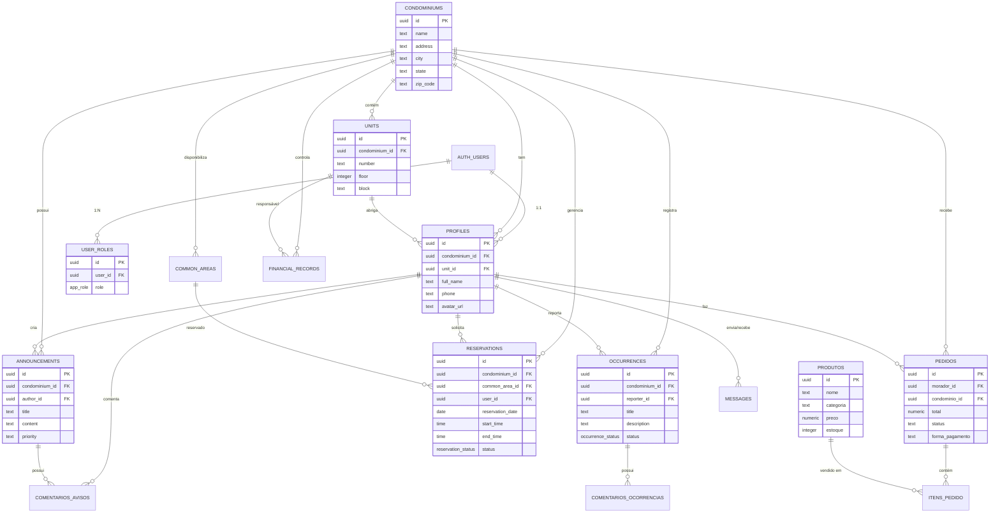

#### 5.1.1 Tabelas Principais

**profiles**
- `id` (uuid, FK para auth.users)
- `full_name` (text)
- `condominium_id` (uuid, FK)
- `unit_id` (uuid, FK)
- `created_at`, `updated_at` (timestamp)
- **Propósito**: Informações adicionais dos usuários

**user_roles**
- `user_id` (uuid)
- `role` (enum: admin, sindico, morador)
- **Propósito**: Sistema de permissões multi-role

**condominiums**
- `id` (uuid)
- `name`, `address`, `city`, `state`, `zip_code` (text)
- `created_at`, `updated_at` (timestamp)
- **Propósito**: Cadastro de condomínios

**units**
- `id` (uuid)
- `condominium_id` (uuid, FK)
- `number` (text)
- `floor` (integer)
- **Propósito**: Unidades dos condomínios (apartamentos/casas)

**announcements**
- `id` (uuid)
- `condominium_id` (uuid, FK)
- `title`, `content` (text)
- `author_id` (uuid, FK)
- `created_at`, `updated_at` (timestamp)
- **Propósito**: Comunicados e avisos

**occurrences**
- `id` (uuid)
- `condominium_id` (uuid, FK)
- `title`, `description` (text)
- `status` (enum: open, in_progress, resolved)
- `priority` (enum: low, medium, high)
- `reporter_id` (uuid, FK)
- `created_at`, `updated_at` (timestamp)
- **Propósito**: Registro de problemas

**reservations**
- `id` (uuid)
- `condominium_id` (uuid, FK)
- `area_name` (text)
- `resident_id` (uuid, FK)
- `date`, `start_time`, `end_time` (timestamp/time)
- `status` (enum: pending, approved, rejected)
- **Propósito**: Reservas de áreas comuns

**payments**
- `id` (uuid)
- `condominium_id` (uuid, FK)
- `resident_id` (uuid, FK)
- `amount` (numeric)
- `due_date`, `paid_at` (timestamp)
- `status` (enum: pending, paid, overdue)
- `description` (text)
- **Propósito**: Controle financeiro

**orders**
- `id` (uuid)
- `user_id` (uuid, FK)
- `product_id`, `product_name` (text)
- `quantity` (integer)
- `total_amount` (numeric)
- `status` (enum: pending, processing, delivered)
- `created_at` (timestamp)
- **Propósito**: Pedidos do marketplace

**messages** (para chat)
- `id` (uuid)
- `sender_id`, `receiver_id` (uuid, FK)
- `content` (text)
- `created_at` (timestamp)
- `read` (boolean)
- **Propósito**: Sistema de mensagens

#### 5.1.2 Enums (Tipos Customizados)
- `app_role`: admin, sindico, morador
- `occurrence_status`: open, in_progress, resolved
- `occurrence_priority`: low, medium, high
- `reservation_status`: pending, approved, rejected
- `payment_status`: pending, paid, overdue
- `order_status`: pending, processing, delivered

#### 5.1.3 Funções do Banco de Dados

**has_role(_user_id uuid, _role app_role)**
- Verifica se um usuário tem uma role específica
- Retorna boolean
- Security definer

**get_user_role(_user_id uuid)**
- Retorna a role primária de um usuário
- Retorna app_role
- Security definer

**get_user_condominium(user_id uuid)**
- Retorna o ID do condomínio do usuário
- Retorna uuid
- Security definer

**handle_new_user()**
- Trigger function para criar profile e role padrão
- Executado ao criar novo usuário no auth.users
- Insere em profiles e user_roles

**update_updated_at_column()**
- Trigger function para atualizar timestamp automaticamente
- Executado antes de UPDATE em tabelas relevantes

#### 5.1.4 Row Level Security (RLS)

**Políticas principais implementadas**:

*profiles*
- SELECT: Usuários podem ver perfis do mesmo condomínio
- UPDATE: Usuários podem atualizar apenas seu próprio perfil
- INSERT: Apenas durante criação de conta (via trigger)

*announcements*
- SELECT: Moradores veem apenas do seu condomínio
- INSERT: Apenas admin e síndico podem criar
- UPDATE/DELETE: Apenas autor ou admin

*occurrences*
- SELECT: Moradores veem apenas do seu condomínio
- INSERT: Qualquer usuário autenticado pode criar
- UPDATE: Apenas síndico/admin podem atualizar status

*reservations*
- SELECT: Moradores veem apenas do seu condomínio
- INSERT: Qualquer morador pode criar
- UPDATE: Apenas síndico/admin podem aprovar/rejeitar

*payments*
- SELECT: Usuários veem apenas seus próprios pagamentos
- INSERT/UPDATE: Apenas síndico/admin

*orders*
- SELECT/INSERT: Usuários veem/criam apenas seus pedidos
- UPDATE: Sistema e admins

### 5.2 Edge Functions (Serverless)

#### 5.2.1 get-cep
- **Localização**: `supabase/functions/get-cep/index.ts`
- **Método**: POST
- **Autenticação**: Não requerida (verify_jwt = false)
- **Propósito**: Consultar endereços via CEP brasileiro
- **API externa**: ViaCEP (https://viacep.com.br/ws/{cep}/json/)
- **Entrada**: `{ cep: string }`
- **Validação**: CEP deve ter 8 dígitos
- **Saída**: Dados do endereço (logradouro, bairro, cidade, estado)
- **CORS**: Habilitado para todas origens

#### 5.2.2 get-weather
- **Localização**: `supabase/functions/get-weather/index.ts`
- **Método**: POST
- **Autenticação**: Não requerida (verify_jwt = false)
- **Propósito**: Obter dados meteorológicos
- **API externa**: OpenWeatherMap (https://api.openweathermap.org/)
- **Entrada**: `{ city?: string, lat?: number, lon?: number }`
- **Secret**: OPENWEATHER_API_KEY (configurado no ambiente)
- **Saída**: Temperatura, descrição, umidade, velocidade do vento
- **CORS**: Habilitado para todas origens

#### 5.2.3 fetch-products
- **Localização**: `supabase/functions/fetch-products/index.ts`
- **Método**: GET
- **Autenticação**: Não requerida (verify_jwt = false)
- **Propósito**: Buscar produtos para o marketplace
- **API externa**: DummyJSON (https://dummyjson.com/products)
- **Query params**: 
  - `limit`: número de produtos (padrão 30)
  - `category`: categoria específica
  - `search`: busca por termo
- **Saída**: Array de produtos com imagens, preços, descrições
- **CORS**: Habilitado para todas origens

#### 5.2.4 fetch-categories
- **Localização**: `supabase/functions/fetch-categories/index.ts`
- **Método**: GET
- **Autenticação**: Não requerida (verify_jwt = false)
- **Propósito**: Listar categorias de produtos
- **API externa**: DummyJSON (https://dummyjson.com/products/categories)
- **Saída**: Array de categorias disponíveis
- **CORS**: Habilitado para todas origens

### 5.3 Sistema de Autenticação
- **Provedor**: Supabase Auth
- **Métodos suportados**:
  - Email/senha
  - Auto-confirmação de email (configurado)
- **Sessão**: Persistida em localStorage
- **Tokens**: JWT com refresh automático
- **Proteção**: RLS policies baseadas em auth.uid()

### 5.4 Secrets (Variáveis de Ambiente)
Configurados no Supabase:
- `OPENWEATHER_API_KEY`: Chave API OpenWeatherMap
- `SUPABASE_URL`: URL do projeto
- `SUPABASE_ANON_KEY`: Chave pública
- `SUPABASE_SERVICE_ROLE_KEY`: Chave administrativa
- `SUPABASE_DB_URL`: URL do banco de dados

---

## 6. Fluxo de Dados

### 6.1 Autenticação

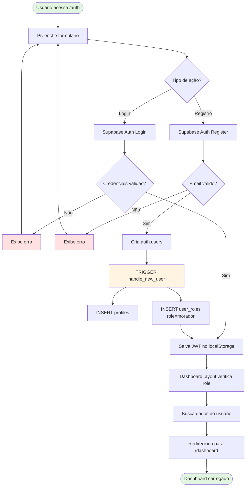

### 6.1 (Detalhado)
```
1. Usuário acessa /auth
2. Preenche formulário de login/registro
3. AuthForm envia credenciais para Supabase Auth
4. Supabase valida e retorna JWT
5. Cliente salva sessão em localStorage
6. Trigger handle_new_user() cria profile e role
7. DashboardLayout verifica sessão e role
8. Usuário é redirecionado para /dashboard
```

### 6.2 Busca de Produtos (Marketplace)

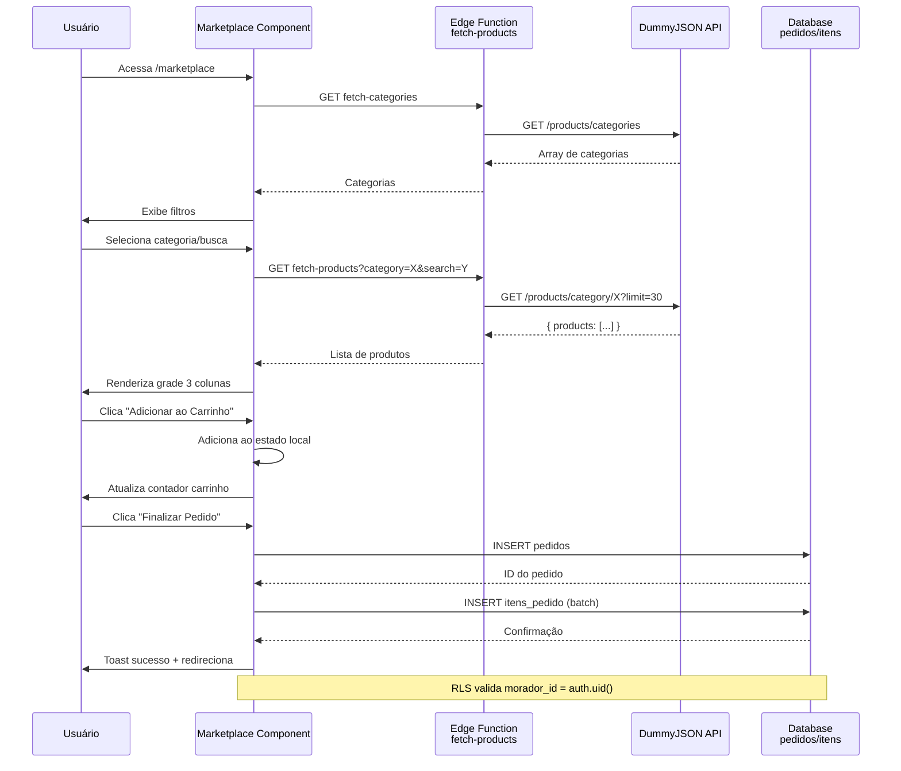
```
1. Usuário acessa /marketplace
2. React component carrega categorias via fetch-categories
3. Usuário seleciona categoria ou busca
4. Component chama fetch-products com parâmetros
5. Edge function busca na DummyJSON API
6. Produtos são retornados e renderizados em grade
7. Usuário adiciona produto ao carrinho
8. Carrinho é salvo em estado local
9. Ao finalizar, pedido é inserido na tabela orders
```

### 6.3 Criação de Comunicado

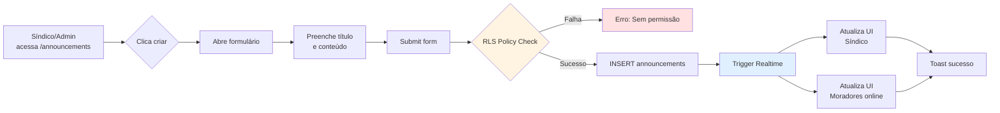
```
1. Síndico/admin acessa /announcements
2. Clica em criar novo comunicado
3. Preenche formulário (título, conteúdo)
4. Submit envia para Supabase
5. RLS policy valida role do usuário
6. Registro inserido em announcements table
7. Realtime atualiza lista para outros usuários
8. Toast confirma sucesso
```

### 6.4 Consulta de CEP

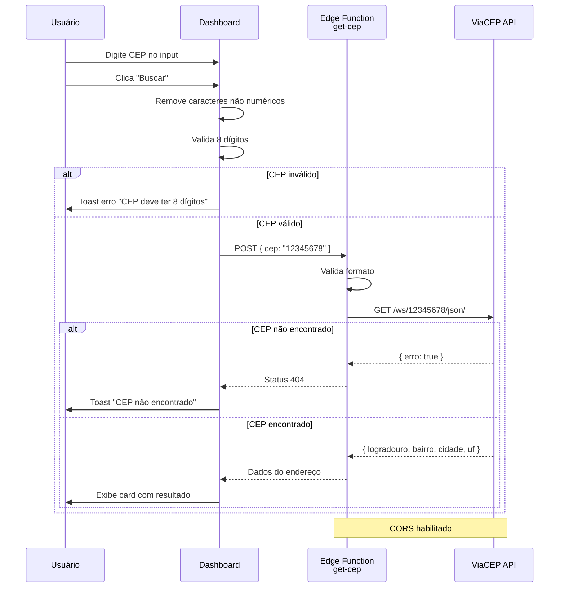
```
1. Usuário digita CEP no Dashboard
2. Clique aciona chamada para get-cep function
3. Edge function valida formato do CEP
4. Faz requisição para ViaCEP API
5. Retorna dados do endereço
6. Interface exibe resultado formatado
```

---

## 7. Segurança

### 7.1 Row Level Security (RLS)

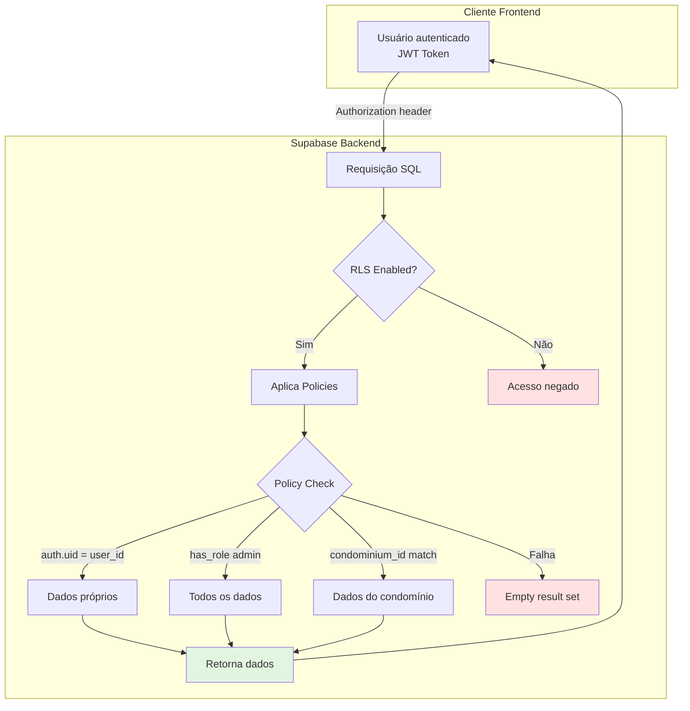

**Exemplo de Policy (announcements)**:
```sql
-- Política de SELECT
CREATE POLICY "Users can view announcements in their condominium"
ON announcements FOR SELECT
USING (
  condominium_id IN (
    SELECT condominium_id 
    FROM profiles 
    WHERE id = auth.uid()
  )
);

-- Política de INSERT (apenas síndico/admin)
CREATE POLICY "Sindicos can create announcements"
ON announcements FOR INSERT
WITH CHECK (
  has_role(auth.uid(), 'sindico') OR 
  has_role(auth.uid(), 'admin')
);
```
- Todas as tabelas possuem RLS habilitado
- Policies baseadas em auth.uid()
- Separação por condomínio_id
- Controle de role para operações sensíveis

### 7.2 Autenticação
- JWT tokens com expiração
- Refresh token automático
- Validação server-side em edge functions protegidas
- Sessões criptografadas

### 7.3 Validação de Dados
- Validação client-side com Zod
- Validação server-side em edge functions
- Constraints no banco de dados
- Sanitização de inputs

### 7.4 CORS
- Configurado em todas edge functions
- Headers apropriados para cross-origin
- Suporte a preflight requests (OPTIONS)

---

## 8. Responsividade

### 8.1 Layout Responsivo

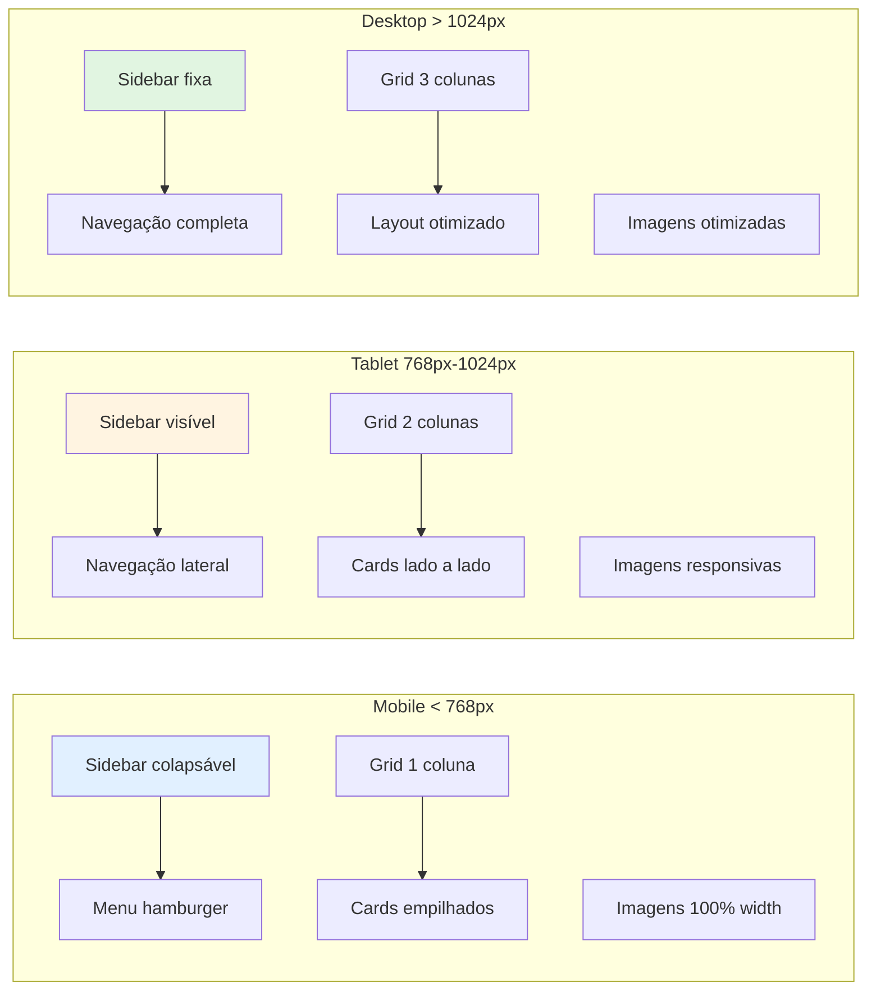

### 8.2 Breakpoints Tailwind
- `sm`: 640px
- `md`: 768px
- `lg`: 1024px
- `xl`: 1280px
- `2xl`: 1536px

### 8.2 Estratégias Mobile-First
- Layouts em coluna única para mobile
- Sidebar colapsável
- Cards empilhados verticalmente
- Imagens responsivas com object-fit
- Touch-friendly (botões maiores, espaçamento adequado)

### 8.3 Marketplace Responsivo
- Mobile: 1 coluna (grid-cols-1)
- Desktop: 3 colunas (md:grid-cols-3)
- Imagens adaptativas (h-40, object-contain)
- Padding consistente entre dispositivos

---

## 9. Performance

### 9.1 Otimizações Frontend
- Code splitting com React.lazy()
- Vite build otimizado
- Tree shaking automático
- CSS purging (Tailwind)
- Image lazy loading

### 9.2 Otimizações Backend
- Índices em colunas de FK
- Queries otimizadas com SELECT específicos
- Conexões pooling (Supabase)
- Edge functions com cold start otimizado
- Cache de API responses quando possível

### 9.3 TanStack Query
- Cache automático de requisições
- Stale-while-revalidate
- Background refetch
- Optimistic updates
- Retry automático

---

## 10. Testes e Qualidade

### 10.1 TypeScript
- Tipagem estática em todo código
- Tipos gerados automaticamente do schema Supabase
- Validação em tempo de compilação
- Interfaces para props de componentes

### 10.2 Validação de Formulários
- React Hook Form para gestão
- Zod schemas para validação
- Mensagens de erro customizadas
- Validação assíncrona quando necessário

### 10.3 Tratamento de Erros
- Try-catch em funções assíncronas
- Error boundaries no React
- Toasts para feedback de erro
- Logging em edge functions

---

## 11. Deploy e CI/CD

### 11.1 Pipeline de Deploy

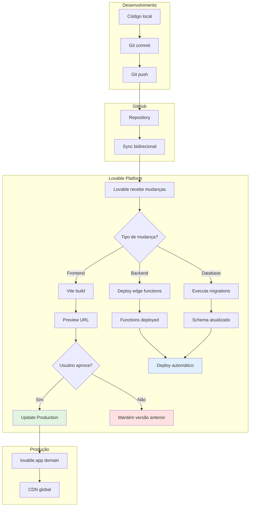

### 11.2 Deploy Frontend
- Plataforma: Lovable (lovable.app)
- Build automático via Vite
- Deploy em produção com um clique
- Preview URLs para cada versão

### 11.2 Deploy Backend
- Edge functions: Deploy automático
- Migrações: Executadas via Lovable Cloud
- Secrets: Gerenciados via interface
- Rollback disponível

### 11.3 Controle de Versão
- Git para versionamento
- GitHub para repositório remoto
- Sync bidirecional com Lovable
- Commits automáticos das mudanças via Lovable

---

## 12. APIs Externas Utilizadas

### 12.1 ViaCEP
- **URL**: https://viacep.com.br
- **Uso**: Consulta de CEP brasileiro
- **Endpoint**: `/ws/{cep}/json/`
- **Autenticação**: Não requerida
- **Limite**: Sem limite oficial, mas recomenda-se cache

### 12.2 OpenWeatherMap
- **URL**: https://openweathermap.org
- **Uso**: Dados meteorológicos
- **Endpoint**: `/data/2.5/weather`
- **Autenticação**: API key (OPENWEATHER_API_KEY)
- **Limite**: Plano free (60 calls/min, 1.000.000 calls/mês)

### 12.3 DummyJSON
- **URL**: https://dummyjson.com
- **Uso**: Produtos e categorias para demonstração
- **Endpoints**:
  - `/products`: Lista produtos
  - `/products/search`: Busca produtos
  - `/products/category/{cat}`: Produtos por categoria
  - `/products/categories`: Lista categorias
- **Autenticação**: Não requerida
- **Limite**: Sem limite (API pública para testes)

---

## 13. Funcionalidades Principais por Role

### 13.1 Admin
- ✅ Gestão completa de condomínios
- ✅ Gestão de todos os usuários
- ✅ Atribuição de roles
- ✅ Acesso a todos os módulos
- ✅ Relatórios globais
- ✅ Configurações do sistema

### 13.2 Síndico
- ✅ Gestão do condomínio específico
- ✅ Criação de comunicados
- ✅ Aprovação de reservas
- ✅ Gestão financeira do condomínio
- ✅ Resolução de ocorrências
- ✅ Gestão de moradores do condomínio

### 13.3 Morador
- ✅ Visualização de comunicados
- ✅ Criação de ocorrências
- ✅ Solicitação de reservas
- ✅ Visualização de pagamentos próprios
- ✅ Marketplace (compras)
- ✅ Chat com síndico
- ✅ Consulta de informações do condomínio

---

## 14. Melhorias Futuras Sugeridas

### 14.1 Funcionalidades
- [ ] Notificações push
- [ ] Integração com gateway de pagamento
- [ ] App mobile nativo (React Native)
- [ ] Sistema de votações/enquetes
- [ ] Controle de visitantes
- [ ] Integração com câmeras/portaria
- [ ] Marketplace com produtos reais
- [ ] Sistema de entregas

### 14.2 Técnicas
- [ ] Testes unitários (Jest)
- [ ] Testes E2E (Playwright)
- [ ] Monitoramento de erros (Sentry)
- [ ] Analytics (Google Analytics)
- [ ] PWA (Progressive Web App)
- [ ] Internacionalização (i18n)
- [ ] Documentação Storybook

---

## 15. Como Executar o Projeto

### 15.1 Pré-requisitos
```bash
- Node.js 18+ 
- npm ou yarn
- Conta Lovable (para backend)
```

### 15.2 Instalação Local
```bash
# Clone o repositório
git clone <URL_DO_REPOSITORIO>

# Entre no diretório
cd <NOME_DO_PROJETO>

# Instale as dependências
npm install

# Configure as variáveis de ambiente
# O arquivo .env já está configurado via Lovable Cloud

# Execute em modo desenvolvimento
npm run dev

# Build para produção
npm run build
```

### 15.3 Acesso ao Sistema
```
URL Desenvolvimento: http://localhost:5173
URL Produção: https://<seu-projeto>.lovable.app

Credenciais de teste:
- Admin: victorodovalho@gmail.com (configurado no sistema)
```

---

## 16. Suporte e Contato

### 16.1 Documentação
- React: https://react.dev
- TypeScript: https://www.typescriptlang.org
- Tailwind CSS: https://tailwindcss.com
- Supabase: https://supabase.com/docs
- Lovable: https://docs.lovable.dev

### 16.2 Recursos do Projeto
- Repositório: GitHub (configurar URL após upload)
- Issues: GitHub Issues
- Documentação: Este arquivo (DOCUMENTACAO.md)

---

## 17. Licença e Créditos

### 17.1 Licença
Este projeto foi desenvolvido para fins acadêmicos.

### 17.2 Tecnologias de Terceiros
- React (MIT License)
- Supabase (Apache 2.0)
- Tailwind CSS (MIT License)
- shadcn/ui (MIT License)
- Todas as outras dependências listadas em package.json

### 17.3 APIs Externas
- ViaCEP: API pública brasileira
- OpenWeatherMap: Requer API key
- DummyJSON: API pública para testes

---

**Última Atualização**: 2025
**Versão**: 1.0.0
**Desenvolvido para**: Trabalho Acadêmico
